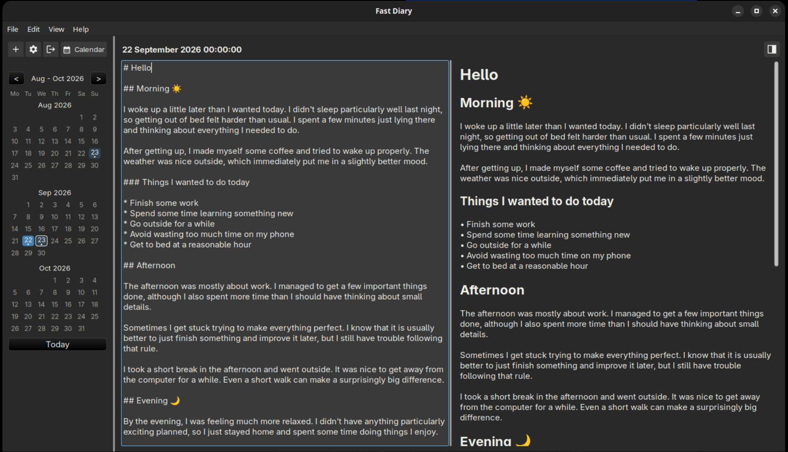

# Fast Diary

A simple, fast diary app for writing your daily notes in Markdown.



## Features

### Folders and diaries

- Choose a folder to keep your diaries in. Each diary is named after the date and time it was
  created.
- The first screen shows the folder chooser and the history of folders you opened before, along
  with a password field for protected folders.
- Your diary is saved automatically as you type, when you switch to another diary, when you close
  the folder and when you close the window. You can also save any time with <kbd>Ctrl</kbd>+<kbd>S</kbd>.
- The **+** button (or <kbd>Ctrl</kbd>+<kbd>N</kbd>) creates a new diary for the current moment.
  If you already have one for this hour, it opens that one instead.

### Calendar and list

- Switch between a **list** view and a **calendar** view of your diaries with the button at the
  right end of the toolbar. Your choice is remembered.
- The calendar shows three months at a time, with arrows to move back and forth and a **Today**
  button to jump to today.
- Days with diaries are marked with dots. Click a day to open its diaries, or click an empty day
  to start a new one.

### Editor and preview

- Switch between editing, editing with a live preview side by side, and preview only.
- The preview supports headings, bold, italic, strikethrough, code, quotes, lists, task lists and
  links.

### Window and layout

- The window remembers its size, position and whether it was maximized, along with the layout of
  the diary list and editor panes.

### Menu and languages

- A full menu bar (File, Edit, View, Help) with keyboard shortcuts for the most common actions.
- Available in English and Türkçe, with an option to follow your system language.

## Download

Every push to `main` builds the program for Linux, Windows and macOS. Builds can be downloaded
from the _Actions_ tab of the repository, and tagged releases are published on the _Releases_
page.

The programs are not signed. Windows shows a _SmartScreen_ warning (choose _More info_ and _Run
anyway_), and macOS blocks the first start (open it with a right click and _Open_, or run
`xattr -d com.apple.quarantine fast-diary`).

## Github release

```bash
git tag -a v0.1.2 -m "v0.1.2"
git push origin v0.1.2
```

## License

Copyright (C) 2026 Emir Buğra Köksalan

Fast Diary is free software: you can redistribute it and change it under the terms of the GNU
General Public License, version 3 or (at your option) any later version. It is distributed in the
hope that it will be useful, but without any warranty. The full text is in the file
[LICENSE](LICENSE).

## Contact

Emir Buğra Köksalan, <kodmanyagha@gmail.com>

- Repository: <https://github.com/kodmanyagha/fast-diary>
- Report an issue: <https://github.com/kodmanyagha/fast-diary/issues>
